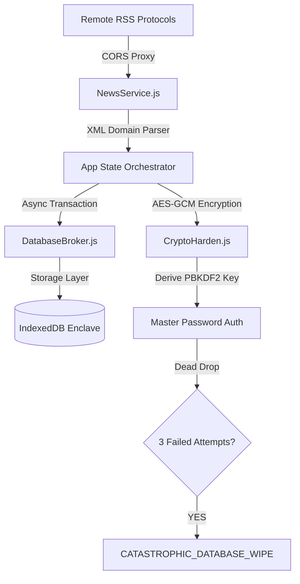

# YANA: Yet Another News Aggregator (V3 Enclave)

YANA V3 is a high-performance, dark-mode exclusive news platform designed for deep immersion and cryptographic privacy. It implements a "Local-First" architecture with hardware-accelerated encryption for personal thought storage.

## ⚡ Technical Architecture



## 🔋 Key Performance Features

- **Progressive Web App (PWA)**: Installable on iOS/Android/Desktop for a native standalone feel with reliable asset caching.
- **Magnetic Doomscrolling**: Kinetic scroll snapping logic for authentic "short-form" focus on relevant dispatches.
- **Adaptive Shimmer Loading**: Skeleton layouts ensure zero "Layout Shift" (CLS) during asynchronous news retrieval.
- **Chrono-Interface**: Dynamic UI shifts from neon blue to deep red based on local system time to mitigate cortisol spikes and blue-light strain during night sessions.
- **Atomic Abstraction**: A modular React component structure ensuring high maintainability and low technical debt.

## 🔐 Security Protocols (Dead Drops)

The **Secure Intelligence Vault** implements industrial-grade AES-GCM encryption with PBKDF2 key derivation.

> [!CAUTION]
> **DEAD DROP ARMED**: This is a strictly local enclave. Forgetting the master password results in permanent data loss. Three consecutive incorrect entries trigger a global wipe of all local databases, custom feeds, and Groq keys for total sterilization.

## 🚀 Deployment Instructions

### Prerequisites
- Node.js v18.x or later
- NPM or PNPM

### Environment Setup
1. Clone the intelligence enclave:
   ```bash
   git clone https://github.com/venkatram-s/YANA.git
   cd YANA
   ```
2. Inject dependencies:
   ```bash
   npm install
   ```
3. Initialize development reactor:
   ```bash
   npm run dev
   ```
4. Generate production build:
   ```bash
   npm run build
   ```

### Attribution
Built with vanilla React, custom XML heuristics, and Web Crypto APIs. Minimal external footprint.
